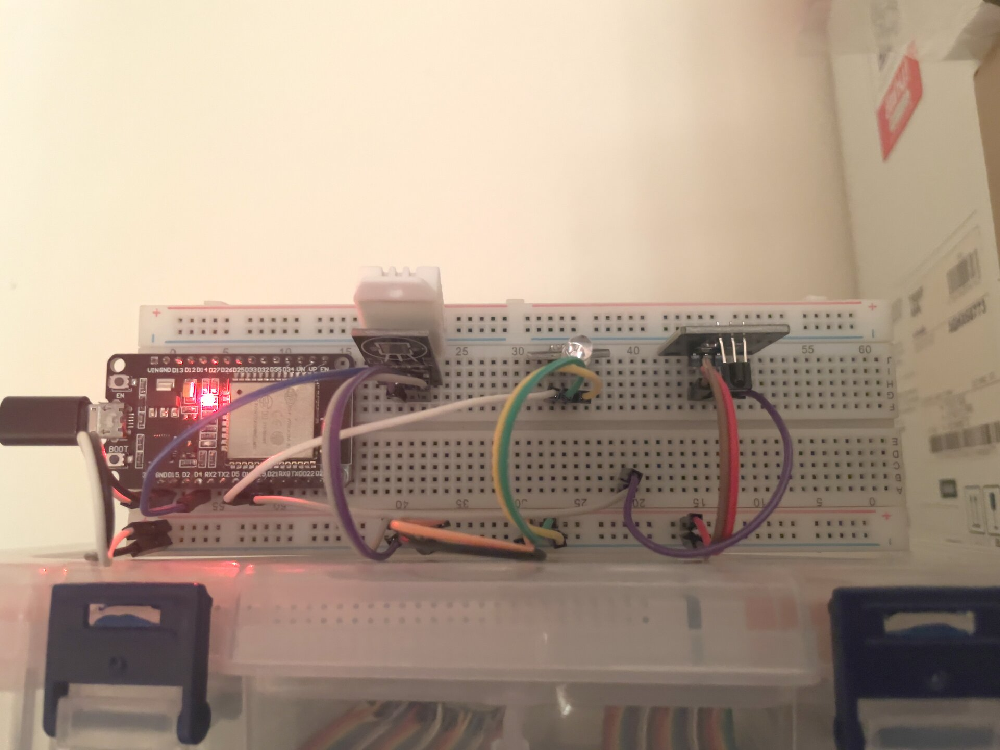

# esphome-mitsubishi-ir

ESP32 IR remote controller for Mitsubishi MH12A AC via ESPHome and Home Assistant.



## Hardware

| Component | GPIO |
|-----------|------|
| IR Transmitter LED | GPIO18 |
| IR Receiver (VS1838B) | GPIO19 (inverted) |
| DHT22 Temperature/Humidity | GPIO4 |
| LED | GPIO2 |

## Features

- Turn AC on/off via Home Assistant toggle switch
- Set temperature 16–30°C via slider — sends IR instantly if AC is on
- Live room temperature and humidity from DHT22 sensor
- State persists across ESP32 reboots

## Home Assistant Entities

| Entity | Type | Description |
|--------|------|-------------|
| Air Conditioner | Switch | Toggle AC on/off |
| AC Temperature | Number | Set target temperature (16–30°C) |
| Temperature | Sensor | Room temperature from DHT22 |
| Humidity | Sensor | Room humidity from DHT22 |
| Blue LED | Light | Onboard LED |

## Protocol

The Mitsubishi MH12A uses the **AEHA IR protocol** (address `0xC4D3`). AEHA transmits data LSB-first, so bytes appear bit-reversed in ESPHome logs. Temperature `T` is encoded in byte[5]:

```
byte[5]       = bitrev(T - 16)
checksum (ON) = bitrev((T - 16) + 0xC5)
checksum (OFF)= bitrev((T - 16) + 0xA5)
```

Each command is sent **twice** with a 50ms gap (AC requirement).

## Recapturing IR Codes

If the AC stops responding (e.g. after changing fan speed on the physical remote):

1. Temporarily set `dump: aeha` in `remote_receiver` in `mitsubishi-mh12a.yaml`
2. Flash the device
3. Point the physical remote at GPIO19 and press buttons
4. Read the new `byte[5]` and checksum values from the ESPHome log
5. Restore `dump: []` and reflash

## Setup

### Requirements

- [ESPHome](https://esphome.io/) 2024+
- Home Assistant with ESPHome integration
- ESP32 dev board

### Wiring

Wire up the components to the GPIOs listed in the Hardware table above. The IR transmitter LED connects through a current-limiting resistor (~100Ω) to GPIO18. The VS1838B receiver signal pin goes to GPIO19 (module handles its own pull-up).

### Installation

1. **Clone the repo**
   ```bash
   git clone https://github.com/FinixEz/esphome-mitsubishi-ir.git
   cd esphome-mitsubishi-ir
   ```

2. **Create your secrets file**
   ```bash
   cp secrets.yaml.example secrets.yaml
   ```
   Edit `secrets.yaml` and fill in your WiFi credentials.

3. **Flash the ESP32**
   ```bash
   esphome run mitsubishi-mh12a.yaml
   ```
   Connect the ESP32 via USB for the first flash. After that, OTA updates work over WiFi.

4. **Add to Home Assistant**
   Go to **Settings → Devices & Services → Add Integration → ESPHome** and enter the device IP or hostname (`mitsubishi-ac.local`). The AC switch, temperature slider, and sensors will appear automatically.
